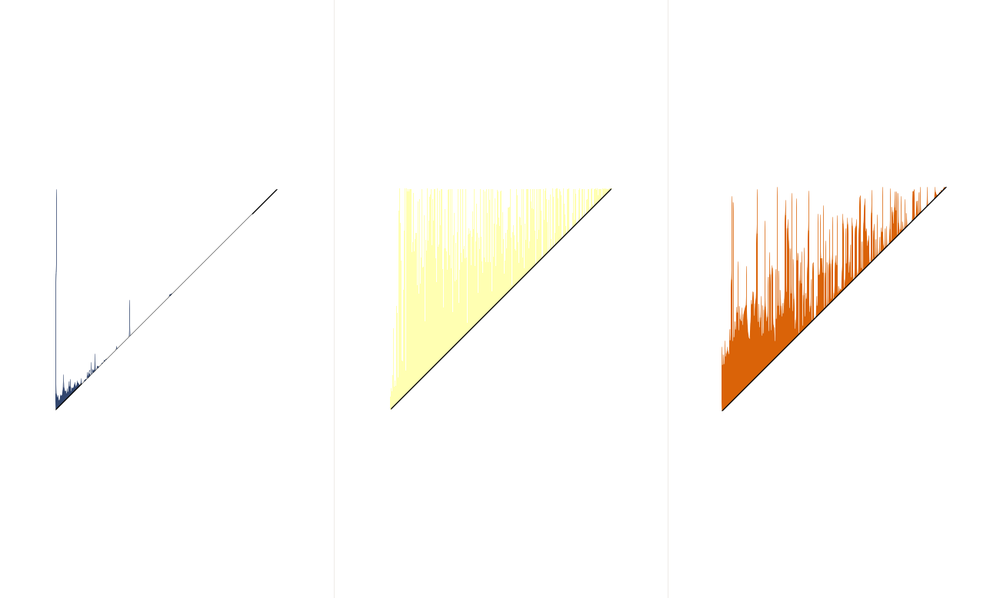

# DDMS-example

This github repository contains the exact code used to reproduce the AT example in the reference below.

## Reference

If you plan to use this code to generate results for a scientific document, thanks for referencing the following publication:

"Distributed Discrete Morse Sandwich: Efficient Computation of Persistence Diagrams for Massive Scalar Data"
Eve Le Guillou, Pierre Fortin, Julien Tierny

## Installation Notes

Tested on Desktop Ubuntu 24.04.2 LTS.

### Install the dependencies

To install the dependencies, run the following commands:

    sudo apt update
    sudo apt install g++ git cmake-qt-gui libboost-system-dev libopengl-dev qttools5-dev libqt5x11extras5-dev libqt5svg5-dev qtxmlpatterns5-dev-tools python3-dev libopenmpi-dev

### Install Paraview

In the following command, replace the `4` in `make -j4 install` by the number of cores available.

    cd ~
    git clone https://github.com/topology-tool-kit/ttk-paraview.git
    cd ttk-paraview
    git checkout 5.12.0
    mkdir build && cd build
    cmake -DCMAKE_BUILD_TYPE=Release -DPARAVIEW_USE_PYTHON=ON -DPARAVIEW_USE_MPI=ON -DPARAVIEW_INSTALL_DEVELOPMENT_FILES=ON -DCMAKE_INSTALL_PREFIX=../install ..
    make -j4 install

Please note that ParaView will use an X server by default to produce the image below. If there are no X server on your machine and that you wish to produce the image, please refer to [this ParaView documentation](https://kitware.github.io/paraview-docs/latest/cxx/Offscreen.html) to build the software using off-screen rendering.

 ### Install TTK using this repository

We will now install TTK using the repository on Github. Again, replace the `4` in `make -j4 install` by the number of cores available.
    
    cd ~/ttk-dev
    mkdir build && cd build
    cmake -DParaView_DIR=$PARAVIEW_PATH -DTTK_ENABLE_MPI=ON -DTTK_ENABLE_MPI_TIME=ON 
    -DTTK_ENABLE_64BITS_IDS=ON -DCMAKE_INSTALL_PREFIX=../install ..
    make -j4 install

### Update environment variables

TTK is now installed, but needs an update of the environment variables to be called easily in the command line.

    export PATH=$PATH:~/ttk-paraview/install/bin/
    TTK_PREFIX=~/ttk-dev/install
    export PV_PLUGIN_PATH=$TTK_PREFIX/bin/plugins/TopologyToolKit
    export LD_LIBRARY_PATH=$TTK_PREFIX/lib:$LD_LIBRARY_PATH
    export PYTHONPATH=$TTK_PREFIX/lib/python3.10/site-packages

### Run the example

First, retrieve this repository.

    cd ~ 
    git clone git@github.com:eve-le-guillou/DDMS-example.git
    cd DDMS-example/

By default, the example is resampled to $128^3$. To execute it using 2 threads and 4 processes, use the following command:

    OMPI_MPI_THREAD_LEVEL=3 OMP_NUM_THREADS=4 mpirun -n 4 pvbatch pipeline.py

If you want to resample to a higher dimension, for example $512^3$ as in the strong scaling benchmark of the reference paper, it can simply be done by executing the following command:

    OMPI_MPI_THREAD_LEVEL=3 OMP_NUM_THREADS=4 mpirun -n 4 pvbatch pipeline.py 512

Be aware that this will require a lot of memory to execute andmay not be possible on a regular laptop.

The command will create the following image and the persistence diagram is `.pvtu` format.

