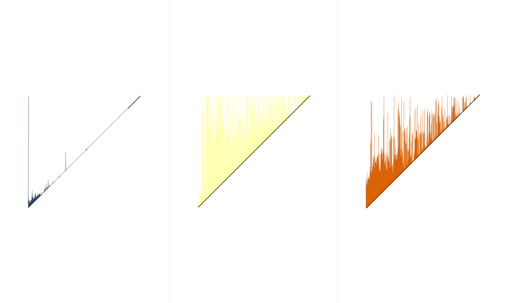

# DDMS-example

## Reference

If you plan to use this code to generate results for a scientific document, thank you for referencing the following manuscript:

*Eve Le Guillou, Pierre Fortin, Julien Tierny. Distributed Discrete Morse Sandwich: Efficient Computation of Persistence Diagrams for Massive Scalar Data. IEEE Transactions on Parallel and Distributed Systems, 2025, pp.1-18. ⟨10.1109/TPDS.2025.3626047⟩.*

Eve Le Guillou is with CNRS, Sorbonne Université, 75005 Paris, France, and also with the University of Lille, 59000 Lille, France.
Pierre Fortin is with CNRS, Centrale Lille, UMR 9189 CRIStAL, University Lille, F-59000 Lille, France.
Julien Tierny is with CNRS, Sorbonne Université, 75005 Paris, France.

## Abstract

The persistence diagram, which describes the topological features of a dataset, is a key descriptor in Topological Data Analysis. The "Discrete Morse Sandwich" (DMS) method has been reported to be the most efficient algorithm for computing persistence diagrams of 3D scalar fields on a single node, using shared-memory parallelism. In the paper associated with this repository, we extend DMS to distributed-memory parallelism for the efficient and scalable computation of persistence diagrams for massive datasets across multiple compute nodes. On the one hand, we can leverage the embarrassingly parallel procedure of the first and most time-consuming step of DMS (namely the discrete gradient computation). On the other hand, the efficient distributed computations of the subsequent DMS steps are much more challenging. To address this, we have extensively revised the DMS routines by contributing a new self-correcting distributed pairing algorithm, redesigning key data structures and introducing computation tokens to coordinate distributed computations. We have also introduced a dedicated communication thread to overlap communication and computation. Detailed performance analyses show the scalability of our hybrid MPI+thread approach for strong and weak scaling using up to 16 nodes of 32 cores (512 cores total). Our algorithm outperforms DIPHA, a reference method for the distributed computation of persistence diagrams, with an average speedup of x8 on 512 cores. We show the practical capabilities of our approach by computing the persistence diagram of a public 3D scalar field of 6 billion vertices in 174 seconds on 512 cores. 

Finally, we provide a usage example of our open-source implementation here. This github repository contains the exact code used to reproduce the Backpack example in the reference above. As the datasets used in the benchmarks of the paper may require to much memory for a normal laptop, a resampling is performed and can be adapted to the user's resources.

This repository is a standalone example created to reproduce the results of the reference above. It is not maintained. For a maintained version of this example, please see the [TTK documentation](https://topology-tool-kit.github.io/examples/distributedPersistenceDiagram/).

## Installation Notes

Tested on Desktop Ubuntu 24.04.2 LTS (preferably with an X server, see the `Install ParaView` section).

Depending on the system on which the installation occurs, this step will take approximately between 30 minutes and a few hours.

### Install the dependencies

To install the dependencies, run the following commands:

    sudo apt update
    sudo apt install g++ git cmake-qt-gui libboost-system-dev libopengl-dev qttools5-dev libqt5x11extras5-dev libqt5svg5-dev qtxmlpatterns5-dev-tools python3-dev libopenmpi-dev

### Install Paraview

In the following command, replace the `4` in `make -j4 install` by the number of cores available.

    cd ~
    git clone https://github.com/topology-tool-kit/ttk-paraview.git
    cd ttk-paraview
    git checkout 5.12.0
    mkdir build && cd build
    cmake -DCMAKE_BUILD_TYPE=Release -DPARAVIEW_USE_PYTHON=ON -DPARAVIEW_USE_MPI=ON -DPARAVIEW_INSTALL_DEVELOPMENT_FILES=ON -DCMAKE_INSTALL_PREFIX=../install ..
    make -j4 install
    PARAVIEW_PATH=~/ttk-paraview/install/lib/cmake/paraview-5.12

Please note that ParaView will use an X server by default to produce the image below. If there are no X server on your machine and that you wish to produce the image, please refer to [this ParaView documentation](https://kitware.github.io/paraview-docs/latest/cxx/Offscreen.html) to build the software using off-screen rendering.

 ### Install TTK using this repository

First, retrieve this repository.

    cd ~ 
    git clone https://github.com:eve-le-guillou/DDMS-example.git

We will now install TTK using the repository on Github. Again, replace the `4` in `make -j4 install` by the number of cores available.
    
    cd ~/DDMS-example/ttk-dev
    mkdir build && cd build
    cmake -DParaView_DIR=$PARAVIEW_PATH -DTTK_ENABLE_MPI=ON -DTTK_ENABLE_MPI_TIME=ON 
    -DTTK_ENABLE_64BITS_IDS=ON -DCMAKE_INSTALL_PREFIX=../install ..
    make -j4 install

### Update environment variables

TTK is now installed, but needs an update of the environment variables to be called easily in the command line.

    export PATH=$PATH:~/ttk-paraview/install/bin/
    TTK_PREFIX=~/DDMS-example/ttk-dev/install
    export PV_PLUGIN_PATH=$TTK_PREFIX/bin/plugins/TopologyToolKit
    export LD_LIBRARY_PATH=$TTK_PREFIX/lib:$LD_LIBRARY_PATH
    export PYTHONPATH=$TTK_PREFIX/lib/python3.12/site-packages

## Run the example

Now, we will run the example. First, download and convert the dataset:

    cd ~/DDMS-example
    pvpython download_data.py

By default, the example is resampled to $128^3$. The execution should take less than a minute. To execute it using 2 threads and 4 processes, use the following command:

    OMPI_MPI_THREAD_LEVEL=3 OMP_NUM_THREADS=4 mpirun -n 4 pvbatch pipeline.py

If your hardware possesses less than 4 cores, MPI will refuse to run . To force the execution, the option `--oversubscribe` needs to be added to the command line:

    OMPI_MPI_THREAD_LEVEL=3 OMP_NUM_THREADS=4 mpirun --oversubscribe -n 4 pvbatch pipeline.py

If you want to resample to a higher dimension, for example $512^3$ as in the strong scaling benchmark of the reference paper, it can simply be done by executing the following command:

    OMPI_MPI_THREAD_LEVEL=3 OMP_NUM_THREADS=4 mpirun -n 4 pvbatch pipeline.py 512

Be aware that this will require a lot of memory to execute and may not be possible on a regular laptop.

The command will create the following image and the persistence diagram is `.pvtu` format.

### Use other datasets

Other datasets of the OpenScivis datasets can be used to run this pipeline. To do so, change the lines 26 and 27 of the script `download_data.py` to match the name of one of the other dataset of OpenSciVis.

### Reproduce the larger example

In the associated paper, the persistence diagram is also computed for a very large dataset (a subset of Turbulent Channel Flow of size 2048x1920x1536). 

To obtain this pipeline, add a `ExtractSubset` filter as done in the following lines to the `download_data.py` (line 35) and save the results of this filter in the `SaveData` function:

	extractSubset1 = ExtractSubset(registrationName='ExtractSubset1', Input=data)
	extractSubset1.VOI = [0, 2047, 0, 1919, 0, 1535]
	
The pipeline in `pipeline.py` should also be modified (by deleting the `ResampleToImage` filter.

Then, the persistence diagram can be produced as it is in the `Run the example` section.

